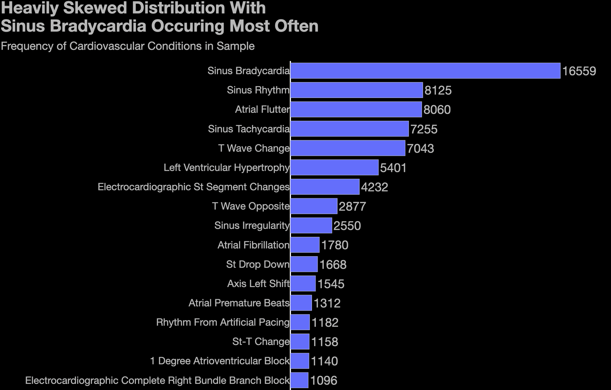
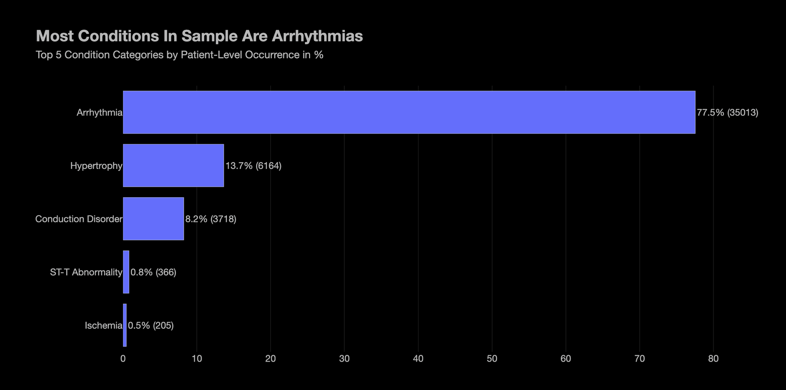
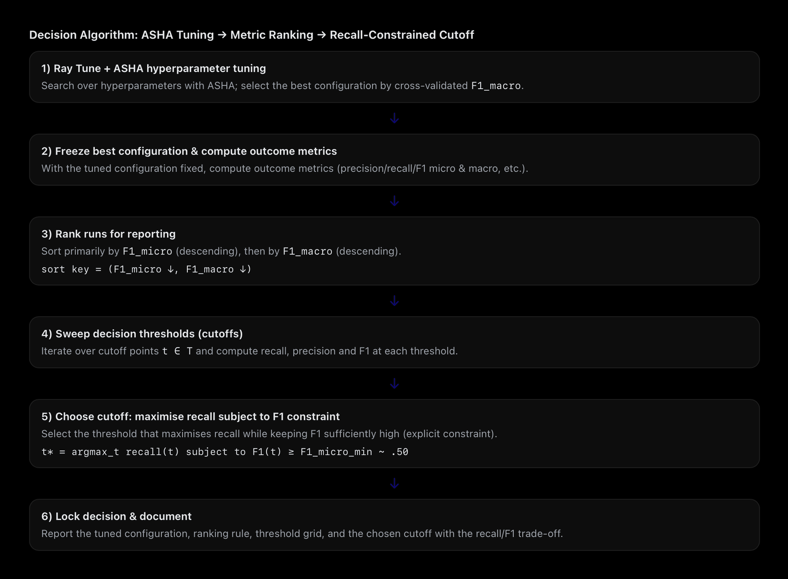
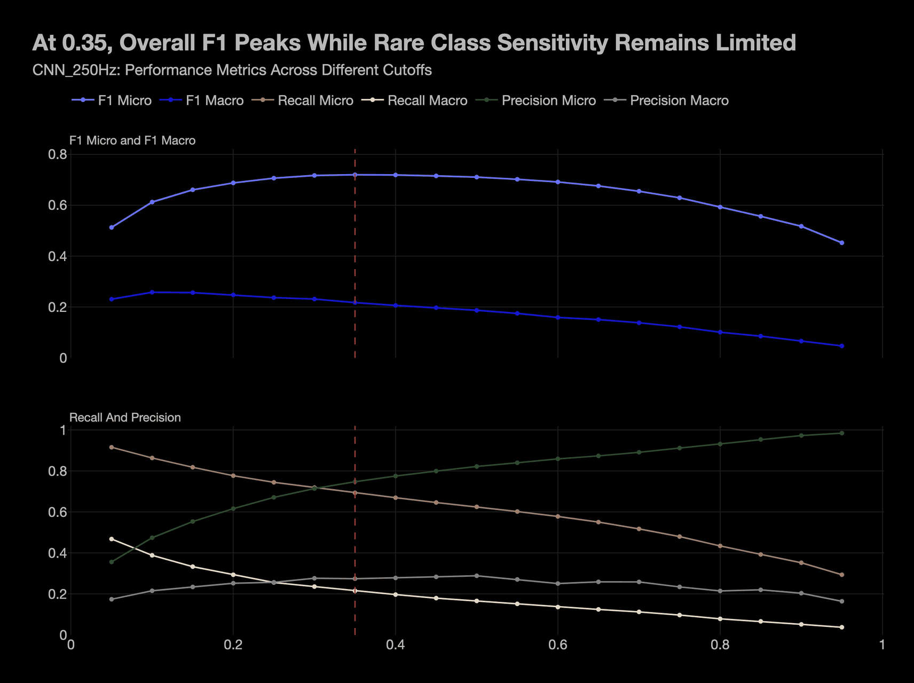
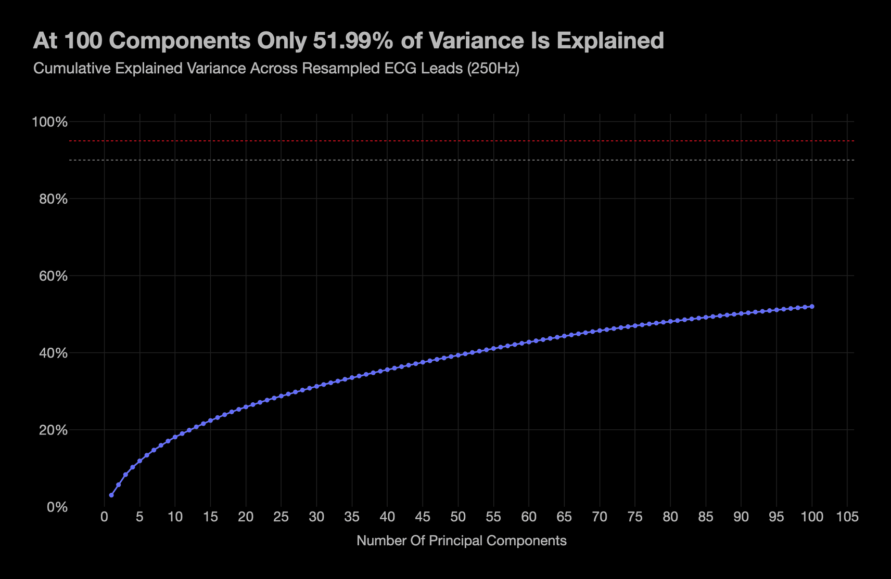
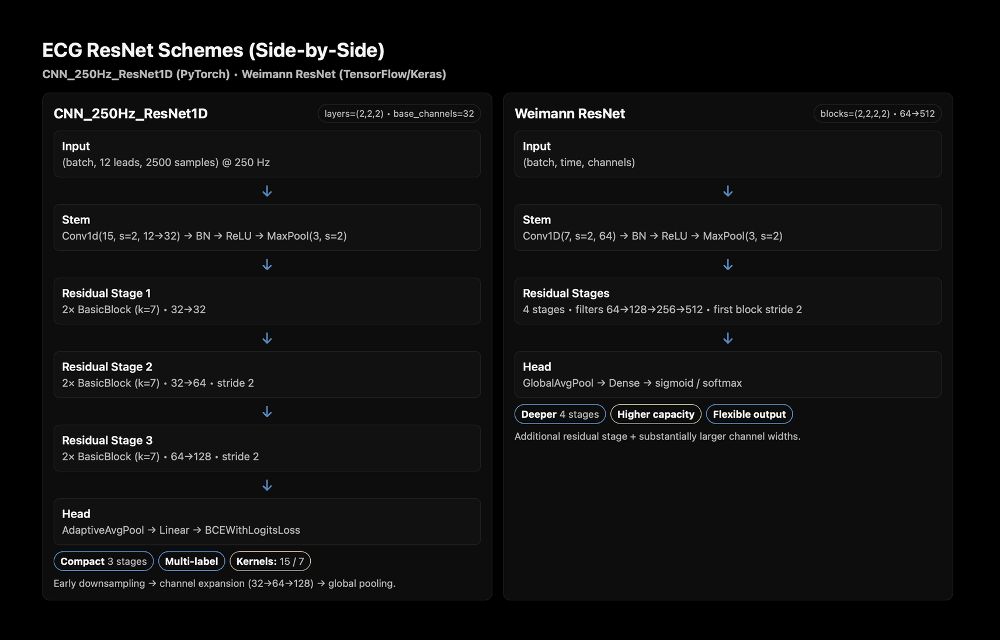

# ECG Arrhythmia Classification

**Multi-label prediction of cardiac conditions from 12-lead ECG, comparing handcrafted signal features against learned representations.**

Five models on 45,152 clinical ECG recordings from Shaoxing People's Hospital,
labelled across 94 diagnostic categories: three built on handcrafted
signal-processing features, two on the raw waveform.

A compact 1D ResNet wins on every metric, reaching 0.71 micro F1 on held-out
data against a strongest-naive-baseline of 0.30. Its macro F1 of 0.21 looks
weak in isolation — but the baseline manages 0.03, so the tail is precisely
where the model adds the most. The gap between those two metrics is the story
of this dataset, and the reason the project concludes with a screening tool
rather than a diagnostic one.

---

## The problem

Each recording carries zero or more SNOMED-CT diagnosis codes, so this is
multi-label, not multi-class: a patient can be in atrial fibrillation *and*
have a bundle branch block. The label distribution is severely long-tailed —
a handful of rhythms account for most of the mass, while many conditions
appear in a few dozen records out of 45,000.



Sinus bradycardia dominates; the tail runs down to conditions appearing once
or twice in 45,152 records. Grouped by category, 77.5% of patients carry an
arrhythmia:



That shape drives three decisions that run through the whole project:

**Micro and macro F1 are always reported together.** Micro is dominated by the
common rhythms; macro weights every condition equally. A model can improve one
while degrading the other, so neither is quoted alone.

**The decision threshold is tuned, not left at 0.5.** With labels this
imbalanced, the default cutoff is arbitrary. Each model's operating point is
selected by sweeping cutoffs against cross-validated predictions, breaking
ties toward recall — the safer direction to err when the cost of a missed
arrhythmia exceeds the cost of a false alarm.

**Thresholds are never selected on the test set.** The sweep runs on training
folds (or, for the CNN, on a validation split carved out of the training
portion). Selecting a cutoff on test data would leak it and inflate the score.



---

## Results

94 diagnostic labels across 45,152 recordings, split 36,121 train / 9,031 test.

### Model comparison at each model's selected cutoff

| Model | Features | Cutoff | F1 micro | F1 macro | Prec. micro | Rec. micro | Prec. macro | Rec. macro |
|---|---|---|---|---|---|---|---|---|
| SGD_18F | 18 handcrafted | 0.45 | 0.1153 | 0.0733 | 0.0621 | 0.8085 | 0.0472 | 0.6098 |
| SGD_13C | 13 PCA of features | 0.45 | 0.1030 | 0.0672 | 0.0550 | 0.7965 | 0.0430 | 0.6217 |
| XGB_18F | 18 handcrafted | 0.30 | 0.5489 | 0.1045 | 0.6270 | 0.4881 | 0.1576 | 0.0934 |
| XGB_100F | 100 signal PCA | 0.30 | 0.5051 | 0.0574 | 0.6286 | 0.4222 | 0.1121 | 0.0515 |
| **CNN_250Hz** | raw 12-lead signal | 0.35 | **0.7196** | **0.2174** | 0.7476 | 0.6937 | 0.2742 | 0.2149 |

These are cross-validated (for the CNN, validation-split) scores — the basis on
which the models were compared.

### CNN_250Hz on the held-out test set

| Cutoff | F1 micro | F1 macro | Prec. micro | Rec. micro | Prec. macro | Rec. macro |
|---|---|---|---|---|---|---|
| 0.35 | 0.7147 | 0.2078 | 0.7478 | 0.6845 | 0.2879 | 0.2078 |



The dashed line is the selected cutoff. Micro F1 is flat between roughly 0.30
and 0.45, so the operating point is not knife-edge — but macro F1 is *falling*
across that whole range, which is the trade-off the single headline number
hides.

The CNN was the selected final model and the only one carried through to the
held-out test set. Validation-to-test drop is 0.005 in micro F1, so the model
generalises and the chosen cutoff transfers.

### Feature-free baselines

No model score means anything without a reference point. These use no features
at all — only label frequencies counted on the training split — and are scored
on the same held-out test set.

| Strategy | Labels predicted | F1 micro | F1 macro | Prec. micro | Rec. micro |
|---|---|---|---|---|---|
| Predict nothing | 0 | 0.0000 | 0.0000 | 0.0000 | 0.0000 |
| Top-1 most frequent | 1 | 0.2474 | 0.0057 | 0.3651 | 0.1871 |
| Top-3 most frequent | 3 | 0.2927 | 0.0122 | 0.2416 | 0.3714 |
| **Top-5 most frequent** | 5 | **0.3009** | 0.0181 | 0.2092 | 0.5359 |
| Top-10 most frequent | 10 | 0.2372 | 0.0254 | 0.1417 | 0.7263 |
| Predict everything | 94 | 0.0407 | 0.0365 | 0.0208 | 1.0000 |

Reproduce in about 15 seconds — it reads only the `.hea` headers, never the
signals:

```bash
python scripts/07_baseline.py
```

The label matrix is 2.07% dense, averaging 1.95 labels per record. The single
most common condition appears in 36.7% of records, and 17 of the 94 labels
appear fewer than ten times in the entire dataset.

**The strongest naive baseline is 0.3009 micro F1.** Three things follow:

- **The CNN is worth having.** 0.7147 against 0.3009 is 2.4x the baseline on
  micro F1 — and on macro F1, 0.2078 against 0.0254 is **8.2x**. The macro
  score that looks weak in isolation is the metric where the model beats a
  feature-free predictor by the widest margin.
- **Both SGD models score *below* the baseline.** At 0.1153 and 0.1030 they
  are less useful than always predicting the five most common rhythms. They
  did not merely underperform; they learned nothing worth using.
- **XGB_18F clears it, modestly.** 0.5489 against 0.3009 is 1.8x.

(The SGD and XGB figures are cross-validated while the baseline is scored on
test. The CNN's validation-to-test gap was 0.005, so the comparison is close
enough to carry the argument, though not exact.)

### What the numbers show

**Linear models fail outright.** One-vs-rest SGD reaches micro F1 of 0.12 at a
cutoff tuned for ~0.80 recall. A linear decision boundary cannot separate
arrhythmias whose signature is waveform morphology, and compressing the
features first (SGD_13C) makes it slightly worse rather than better.

**Handcrafted features beat an unsupervised basis over the raw signal.**
XGB_18F edges out XGB_100F by 0.044 micro F1 and 0.047 macro. The reason is
visible in the variance: the 13 components in SGD_13C retain 96.0% of feature
variance, but the 100 Incremental-PCA components in XGB_100F capture only
**52.0%** of raw waveform variance. PCA is the wrong tool for this signal —
diagnostic information lives in localised morphology, not in the directions of
greatest global variance.



**The CNN wins because it learns temporal filters.** At 250 Hz each sample is
4 ms, so the stem's kernel of 15 spans ~60 ms and the residual blocks' kernel
of 7 spans ~28 ms — both on the scale of a QRS complex, which typically runs
60–120 ms (Sattar & Chhabra, 2023). The architecture is matched to the
physiology it needs to detect.



The right-hand column is the ResNet from [Weimann & Conrad (2021), *Transfer
learning for ECG classification*](https://doi.org/10.1038/s41598-021-84374-8),
used here as the reference design. Theirs is deeper — four residual stages
against three — and substantially wider, running 64→512 channels where this one
runs 32→128. The model here is deliberately smaller: it trains on CPU, and it
uses a wider stem kernel (15 against 7) because at 250 Hz that spans a full QRS
complex in a single convolution.

**Every model collapses on macro metrics — but relative to baseline, that is
where the CNN does best.** The best macro F1 is 0.22 against a micro F1 of
0.72, and the long tail is why: 17 of the 94 conditions appear fewer than ten
times, so aggregate performance is carried by a handful of common rhythms.
Read against the 0.025 naive baseline, though, the macro score is an 8x
improvement rather than a failure. Rare classes were deliberately retained
rather than filtered, since they are often the clinically significant ones,
but absolute per-class reliability remains low and predictions for them should
be treated with caution. `outputs/tables/*_per_label.csv` shows exactly which conditions the
model never predicts.

The practical reading: this is a **screening** tool for well-represented
arrhythmias, not a diagnostic replacement.

**On reproducibility.** Re-running will not reproduce these figures exactly.
Ray Tune's search is seeded but its trial scheduling is not fully
deterministic under parallel execution, and some CUDA kernels are
nondeterministic. Expect variation in the third decimal place.

## Repository layout

```
src/ecg/
  config.py            Paths, constants, seeding, YAML config loading
  data/
    wfdb.py            WFDB .mat/.hea reading into a padded signal tensor
    labels.py          SNOMED-CT code normalisation and condition lookup
    leads.py           Lead names parsed from headers, not assumed
    resample.py        Polyphase 500 Hz to 250 Hz resampling
  features/
    waveform.py        R-peak detection, PR/QRS/QT intervals, HRV statistics
    spectral.py        Welch PSD, LF/HF band powers, spectral entropy
    complexity.py      Approximate/sample entropy, DFA, Higuchi dimension
    extract.py         Assembles the 22-feature vector per record
  preprocessing.py     Imputation, label binarisation, train/test splitting
  decomposition.py     PCA on features; Incremental PCA on raw signal
  models/
    registry.py        Maps model names to build/tune/feature-source specs
    sklearn_models.py  SGD and XGBoost specs (all four registered here)
    cnn.py             1D ResNet, defined once
  tuning/ray_search.py One Ray Tune harness for every model
  evaluation/
    metrics.py         Multi-label metrics, micro and macro
    thresholds.py      Cutoff sweeps and operating-point selection
  viz/                 One chart theme, one set of result charts

scripts/               Runnable pipeline stages, in order
configs/               Data settings and per-model frozen hyperparameters
tests/                 pytest suite (31 tests, no dataset required)
```

---

## Running it

```bash
python -m venv .venv && source .venv/bin/activate
pip install -r requirements.txt
```

Then, in order:

```bash
python scripts/01_build_dataset.py --limit 500
```

```bash
python scripts/02_extract_features.py
```

```bash
python scripts/03_train.py --model xgb_18f
```

`--limit` caps how many records are read; drop it for the full run. Every
model goes through the same script:

```bash
python scripts/03_train.py --model sgd_18f
```

The raw-signal models need the resampling and PCA stage first:

```bash
python scripts/04_signal_pca.py --components 100
```

```bash
python scripts/05_train_cnn.py --epochs 8
```

```bash
python scripts/06_compare_models.py
```

### Hyperparameters are frozen by default

`configs/models/*.yaml` holds the winning configuration from each search, so a
run reproduces in minutes instead of re-searching for hours. To search again:

```bash
python scripts/03_train.py --model xgb_18f --retune --trials 50
```

That prints the configuration it found and tells you to update the YAML —
deliberately, rather than by pasting values back into the code.

### Tests

```bash
python -m pytest
```

The suite runs without the dataset: it uses synthetic two-rhythm signals to
exercise the full path and to check that the feature extractor recovers a
known heart rate.

---

## Getting the data

The **ECG Arrhythmia Dataset** from PhysioNet — about 5.3 GB uncompressed, and
not included here.

<https://physionet.org/content/ecg-arrhythmia/1.0.0/>

```bash
wget -r -N -c -np https://physionet.org/files/ecg-arrhythmia/1.0.0/
```

Place it at `./ecg_data/`, or point `ECG_DATA_ROOT` at an existing copy:

```bash
export ECG_DATA_ROOT=/Volumes/external/ecg_data
```

The pipeline expects `ecg_data/WFDBRecords/`, `ConditionNames_SNOMED-CT.csv`
and `Remaining_DX_Codes_SNOMED_Labels.csv`.

---

## Method notes and limitations

**Fiducial points are approximated, not delineated.** P, QRS and T boundaries
are located by fixed physiological offsets from each detected R peak rather
than by a proper delineation algorithm. This is fast enough for 45,000 records
and robust to noise, but the intervals should be read as population-level
descriptors, not as clinical measurements on any individual trace.

**Features come from one lead.** Handcrafted extraction uses lead II only
(index 1), where the P wave is typically clearest. The raw-signal models use
all twelve.

**250 Hz for the raw-signal models.** Halves memory for the Incremental PCA
pass and the CNN, and the diagnostic content of a surface ECG sits well below
the 125 Hz Nyquist limit this affords. Resampling is polyphase, so decimation
anti-aliases rather than folding high-frequency noise into the band of
interest.

**Two features are dropped before modelling.** `higuchi_fractal_dimension` and
`dfa_scaling_exponent` are both RR-derived and undefined for short records, so
they carry the most missingness of the 22. The rest are median-imputed.

**Not a clinical tool.** This is a methods study on a public research dataset.
Nothing here is validated for diagnostic use.

---

## Figures

Six figures are embedded above. The full set — per-model tuning histories and
cutoff sweeps, the conditional-probability matrix, feature correlations and
lead-level examples — is indexed in [`docs/figures/`](docs/figures/).

---

## References

**Dataset**

Zheng, J., Guo, H. and Chu, H. (2022). *A large scale 12-lead electrocardiogram
database for arrhythmia study* (version 1.0.0). PhysioNet.
<https://doi.org/10.13026/wgex-er52>

**Architecture**

Weimann, K. and Conrad, T. O. F. (2021). Transfer learning for ECG
classification. *Scientific Reports*, 11, Article 5251.
<https://doi.org/10.1038/s41598-021-84374-8>

Kiranyaz, S., Ince, T. and Gabbouj, M. (2016). Real-Time Patient-Specific ECG
Classification by 1-D Convolutional Neural Networks. *IEEE Transactions on
Biomedical Engineering*, 63(3), pp. 664–675.
<https://doi.org/10.1109/TBME.2015.2468589>

**Signal processing and features**

Welch, P. D. (1967). The use of fast Fourier transform for the estimation of
power spectra. *IEEE Transactions on Audio and Electroacoustics*, 15(2),
pp. 70–73. <https://doi.org/10.1109/TAU.1967.1161901>

Task Force of the European Society of Cardiology and the North American Society
of Pacing and Electrophysiology (1996). Heart rate variability: standards of
measurement, physiological interpretation and clinical use. *Circulation*,
93(5), pp. 1043–1065. <https://doi.org/10.1161/01.CIR.93.5.1043>

Pincus, S. M. (1991). Approximate entropy as a measure of system complexity.
*PNAS*, 88(6), pp. 2297–2301. <https://doi.org/10.1073/pnas.88.6.2297>

Richman, J. S. and Moorman, J. R. (2000). Physiological time-series analysis
using approximate entropy and sample entropy. *American Journal of Physiology*,
278(6), pp. H2039–H2049.
<https://doi.org/10.1152/ajpheart.2000.278.6.H2039>

Peng, C.-K., Havlin, S., Stanley, H. E. and Goldberger, A. L. (1995).
Quantification of scaling exponents and crossover phenomena in nonstationary
heartbeat time series. *Chaos*, 5(1), pp. 82–87.
<https://doi.org/10.1063/1.166141>

Higuchi, T. (1988). Approach to an irregular time series on the basis of the
fractal theory. *Physica D*, 31(2), pp. 277–283.
<https://doi.org/10.1016/0167-2789(88)90081-4>

Postema, P. G. and Wilde, A. A. M. (2014). The measurement of the QT interval.
*Pacing and Clinical Electrophysiology*, 37(5), pp. 631–642.
<https://doi.org/10.1111/pace.12410>

Sattar, Y. and Chhabra, L. (2023). *Electrocardiogram*. StatPearls. — source for
the 60–120 ms QRS duration.

**Method**

Chen, W., Yang, K., Yu, Z. and Shi, Y. (2024). A survey on imbalanced learning:
latest research, applications and future directions. *Artificial Intelligence
Review*, 57(3), pp. 1–32. <https://doi.org/10.1007/s10462-024-10759-6>

Psychophysiology (2023). Guidelines on ECG sampling frequency (250–1000 Hz) for
heart period measurement in HRV studies.
<https://doi.org/10.1111/j.1469-8986.2023.14604.x>

Pedregosa, F. et al. (2011). Scikit-learn: Machine Learning in Python. *Journal
of Machine Learning Research*, 12, pp. 2825–2830.
<https://jmlr.org/papers/v12/pedregosa11a.html>

---

## Licence

MIT — see [LICENSE](LICENSE).

The PhysioNet dataset carries its own licence; consult the source before
redistributing any part of it.
